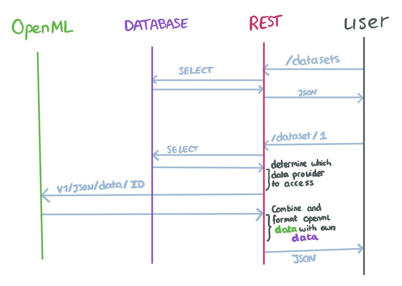

# FastAPI + Database (MySQL) Server Demo

This repository contains an example of how to provide a REST API built with [FastAPI](https://fastapi.tiangolo.com/)
that interacts with a database ([MySQL](https://hub.docker.com/_/mysql))
and [OpenML's REST API](https://www.openml.org/apis).
Both the database and the REST API are run from docker in separate containers.

The REST API demonstrates an example simplified AIoD application of providing information on datasets and publications.
It has its own database in which to store meta-data,
but can also access additional meta-data from data providers (only OpenML in the demo).
An example flow of a user requesting a list of datasets, and then obtaining detailed meta-data for the dataset is shown
below.



*Tested and developed on `MacOS 12.4`, `Docker 20.10.17`.*

## Installation

This repository contains two systems; the database and the REST API.
As a database we use a containerized MySQL server (through Docker), the REST API can be run locally or containerized.
Information on how to install Docker is found in [their documentation](https://docs.docker.com/desktop/).

### Starting a MySQL Server

We use the default [MySQL Docker image](https://hub.docker.com/_/mysql).
By default, the database is stored within the docker container and will thus be deleted when the container is removed.
Instructions on using a persistent storage can be found at the end of this section.

First, we define a docker network to allow our server to be reachable from other docker containers:

```bash
docker network create sql-network
```

Then, start the MySQL Server:

```bash
docker run -e MYSQL_ROOT_PASSWORD=ok --name sqlserver --network sql-network -d mysql
```

That's all! You should be able to connect to the server now, though no database is present yet:

```bash
docker run -it --network sql-network --rm mysql mysql -hsqlserver -uroot -pok
```

```bash
mysql> SHOW DATABASES;
+--------------------+
| Database           |
+--------------------+
| information_schema |
| mysql              |
| performance_schema |
| sys                |
+--------------------+
4 rows in set (0.03 sec)
```

#### Persistent Storage

The data is persistent when simply stopping and restarting the server:

```bash
docker stop sqlserver
docker start sqlserver
```

However, all data is lost when the container is deleted.
To ensure data can persist even if the container is deleted, allow the Docker container to write to a directory on the
host machine.
To do that, mount a volume by adding `-v /ABSOLUTE/PATH/TO/HOST/DIR:/var/lib/mysql` to the docker command that starts
the server
(it's also possible to create a docker
volume ([docs](https://docs.docker.com/engine/reference/commandline/run/#mount-volume--v---read-only))).
If you want to use a path within this repository directory, we recommend naming the directory `data` since then it will
automatically be ignored by git.
For more information, see "Where to Store Data" in the linked documentation.

### Starting the REST API

The repository provides a Dockerfile to run the REST API in a containerized environment.

#### Using the Docker container

First, build the docker image from the dockerfile:

```bash
docker build --tag ai4eu_server_demo:latest -f Dockerfile .
```

then create a container from that image, remember to forward the port and connect to the right docker network.

```bash
docker run --network sql-network -it -p 8000:8000 --name apiserver -v /ABSOLUTE/PATH/TO/SRC:/app ai4eu_server_demo
```

At this point you should be able to visit the server from your browser at `localhost:8000/docs`.

#### Local Installation

If you want to run the server locally, you need Python 3.11.
We advise creating a virtual environment first and install the dependencies there:

```bash
python3 -m venv venv
source venv/bin/activate
python -m pip install -r requirements.txt
```

Note that the `mysqlclient` dependency requires additional tooling before it can be installed.
In case this tooling is not already available, please have a look
at [their installation instructions](https://github.com/PyMySQL/mysqlclient#install).

After installing the dependencies you can start the server:

```bash
cd src
python main.py --reload
```

The `--reload` argument will automatically restart the app if changes are made to the source files.

### Populating the Database

By default, the app will connect to the database and populate it with a few items if there is no data present.
You can change this behavior through parameters of the script:

* **rebuild-db**: "no", "only-if-empty", "always". Default is "data".
    * no: connect to the database but don't make any modifications on startup.
    * only-if-empty: if the database does not exist, create it. Then, if the tables do not exist, create them.
      Then, if the tables are empty, populate according to `populate`.
    * always: drop the configured database and rebuild its structure from scratch.
      Effectively a `DROP DATABASE` followed by a `CREATE DATABASE` and the creation of the tables.
      The database is then repopulated according to `populate`.
      **Important:** data in the database is not restored. All data will be lost. Do not use this option
      if you are not sure it is what you need.

* **populate**: one of "nothing", "example", or "openml". Default is "example".
  Specifies what data to add the database, only used if `rebuild-db` is "only-if-empty" or "always".
    * nothing: don't add any data.
    * example: registers two datasets and two publications.
    * openml: registers all datasets on OpenML, this may take a while (~30 minutes).

## Usage

Following the installation instructions above, the server may be reached at `127.0.0.1:8000`.
REST API documentation is automatically built and can be viewed at `127.0.0.1:8000/docs`.

#### Editing Files Locally

While developing the server it is often convenient to edit the files on the host machine.
To avoid rebuilding the docker container each time you edit the files, you can mount the host files into the container.
Mount your repository's `src` directory into the container's `/app` directory by adding `-v $(pwd)/src:/app`.

#### Automatically Restart on Change

If you want to automatically restart the server when a change is made to a file in the project, use the `--reload`
parameter.
It is important to realize that this also re-initializes the connection to the database, and possibly will do any
start-up work (e.g., populating the database).

#### Database Structure

The Python classes that define the database tables are found in [src/database/models.py](src/database/models.py).
Additionally, a relationship table between the Dataset and Publication is made to allow for their many-to-many
relationship.

**Dataset**: stores simple meta-data for datasets with different data providers

| Attribute                    | Description                                                                     |
|------------------------------|---------------------------------------------------------------------------------|
| id                           | a unique identifier                                                             |
| name                         | name of the dataset                                                             |
| platform                     | identifies the platform on which the dataset is stored                          |
| platform_specific_identifier | the identifier with which the dataset is uniquely identified at the `platform`. |

**Publication**: stores simple meta-data for publications

| Attribute | Description                                    |
|-----------|------------------------------------------------|
| id        | a unique identifier                            |
| title     | title of the publication                       |
| url       | link to a page where the paper can be accessed |

**dataset_publication**: stores which datasets are related to which publications

| Attribute      | Description                              |
|----------------|------------------------------------------|
| publication_id | refers to an id in the publication table |
| dataset_id     | refers to an id in the dataset table     |
 